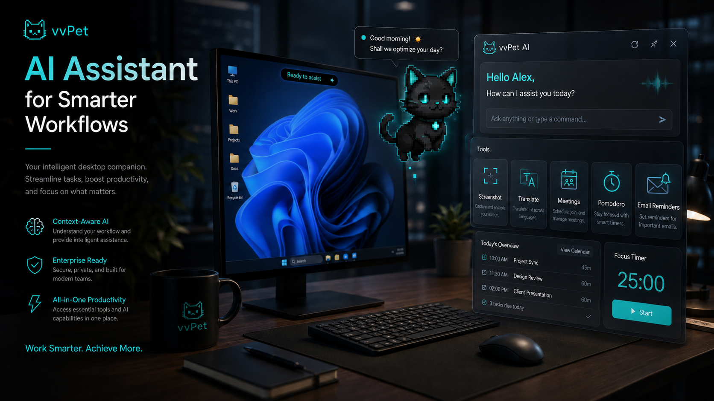

<div align="center">

<!-- 修复：fontSize 从 90 降到 65，height 从 300 升到 320，确保 vvPet 完整显示 -->


<br>

<!-- Badges -->
<a href="https://github.com/cqzmc/vvpet-release/releases">
  
</a>
<a href="#">
  
</a>
<a href="#">
  
</a>
<a href="#">
  
</a>
<a href="#">
  
</a>
<a href="#license">
  
</a>

<br><br>

<!-- Tagline -->
<p align="center">
  <b>🐱 常驻桌宠 · 🤖 AI 助手 · 🎙️ 离线语音 · 🍅 番茄钟 · 📝 会议记录</b>
</p>

<p align="center">
  将 AI 办公所需的一切，浓缩进一个不打断你工作的轻量桌面萌宠
</p>

<br>

<!-- Download Button -->
<a href="https://github.com/cqzmc/vvpet-release/releases">
  
</a>

</div>

---



<br>

## ✨ 产品亮点

<div align="center">

| 🖥️ 桌面常驻 | 🤖 AI 办公助手 | 🛠️ 快捷工具 | 🔒 隐私优先 |
|:---:|:---:|:---:|:---:|
| 透明宠物窗口常驻桌面，独立聊天窗口分离，桌宠负责陪伴、提醒和状态反馈 | 多模型配置、企业默认模式、深度思考、联网搜索、历史会话恢复 | 上传文件、截图识别、翻译、桌面搜索、会议记录、番茄钟一框搞定 | API Key 写入 Windows 凭据管理器，本地搜索需显式授权 |

</div>

<br>

## 🎯 功能全景

<!-- 修复：用 #### 代替 ###，避免字体过大；用 <br> 分隔避免解析混乱 -->

#### 🤖 AI 对话

- 多模型配置自由切换
- 企业账号与默认模式
- 深度思考（Chain-of-Thought）
- 联网搜索实时信息
- 历史会话搜索、恢复与彻底删除
- 聊天字号自由调节

<br>

#### 🖼️ 文件与截图

- 文件上传与解析
- 区域截图识别
- 本地 OCR 文字提取
- PDF 文本提取（pdfjs-dist + Rust 本地处理）

<br>

#### 🔍 搜索

- 本地文件搜索（需显式授权目录）
- 拒绝静默扫描，隐私边界清晰

<br>

#### 🎙️ 语音

- **Whisper / Vosk** 离线语音模型管理
- **Piper** 文字转语音运行时与模型下载
- 系统语音回退机制
- 全程无需联网

<br>

#### 📝 会议

- 会议录音与离线转写
- 会议文本整理入口
- 本地处理，数据不出境

<br>

#### 🍅 番茄钟

- 专注计时与待办状态
- 持久化保存，重启不丢失
- 桌宠状态联动反馈

<br>

#### 🔔 办公提醒

- Outlook 未读邮件提醒（本机 COM 直连）
- 系统托盘通知
- 桌宠浮动胶囊消息（长内容自动横向滚动）
- 开机启动与启动时更新检查

<br>

#### 🐱 桌面萌宠

- 透明宠物窗口常驻桌面
- Pixel Cat 用表情和胶囊消息陪伴你工作
- Hoop Chick 接口预留，后续可接入完整动作

<br>

## 🏗️ 技术架构

<div align="center">

<table>
  <tr>
    <td align="center" width="140">
      <br>
      <sub><b>Vue 3</b></sub><br>
      <sub>响应式前端</sub>
    </td>
    <td align="center" width="140">
      <br>
      <sub><b>TypeScript</b></sub><br>
      <sub>类型安全</sub>
    </td>
    <td align="center" width="140">
      <br>
      <sub><b>Vite</b></sub><br>
      <sub>极速构建</sub>
    </td>
    <td align="center" width="140">
      <br>
      <sub><b>Rust</b></sub><br>
      <sub>高性能后端</sub>
    </td>
    <td align="center" width="140">
      <br>
      <sub><b>Tauri 2</b></sub><br>
      <sub>轻量桌面</sub>
    </td>
  </tr>
</table>

</div>

<br>

## 📁 仓库结构

```text
vvpet/
├─ 📂 docs/                   需求文档、方案设计、README 配图
├─ 📂 vv/                     主应用目录
│  ├─ 📂 src/                 Vue 3 前端源码
│  ├─ 📂 src-tauri/           Rust / Tauri 后端
│  ├─ 📂 scripts/             构建与版本脚本
│  └─ 📂 build-dist/          前端构建输出
├─ 📄 AGENTS.md               仓库协作说明
└─ 📄 README.md               项目说明
```

<br>

## 🚀 快速开始

**环境要求**

- Windows 10 / 11
- Node.js 18+
- Rust stable
- Visual Studio C++ Build Tools
- Microsoft Edge（微信文件传输助手外部窗口方案需要）

<br>

**开发启动**

```bash
# 进入项目目录
cd vv

# 安装依赖
npm install

# 启动完整开发环境（前端 + Tauri）
npm run dev

# 仅预览前端
npm run dev:frontend
# 默认地址: http://127.0.0.1:1988
```

<br>

**常用命令**

```bash
# 前端类型检查
npm run check

# 仅构建前端产物
npm run build:frontend

# Rust 测试
npm run test:rust

# 发布构建（递增 patch 版本号 + 生成 NSIS 安装包）
npm run build
```

> 📦 安装包输出：`vv/src-tauri/target/release/bundle/nsis/vv_<version>_x64-setup.exe`

<br>

## 🔐 隐私与数据

<div align="center">

| 数据类型 | 处理方式 | 说明 |
|---------|---------|------|
| 🔑 API Key / Token | Windows 凭据管理器 | 加密存储，不落地明文 |
| 💬 历史会话 | 应用数据目录本地保存 | 可搜索、恢复、彻底删除 |
| 📁 本地搜索 | 显式授权目录 | 拒绝静默扫描 |
| 📧 Outlook | 本机 COM 直连 | 不走任何中转服务 |
| 🎙️ 语音数据 | 本地模型处理 | Whisper / Vosk / Piper 完全离线 |

</div>

<br>

## 📸 界面预览

> 主聊天框、桌面宠物、Pixel Cat 表情反馈、浮动胶囊消息等界面截图可放置在 `docs/images/` 目录下。

<div align="center">

<!-- 替换为实际截图路径 -->
<!--  -->

*🐱 Pixel Cat 正在陪伴你工作...*

</div>

<br>

## 📜 License

<div align="center">

[MIT](LICENSE) © 2026 vvPet

</div>

---

<div align="center">

⭐ 如果 vvPet 对你有帮助，欢迎点个 Star 支持一下！

<a href="https://github.com/cqzmc/vvpet-release">
  
</a>

</div>

<br>

## ⭐ Star History

<div align="center">

[](https://star-history.com/#cqzmc/vvpet-release&Date)

</div>


